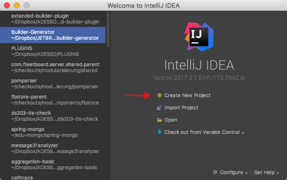
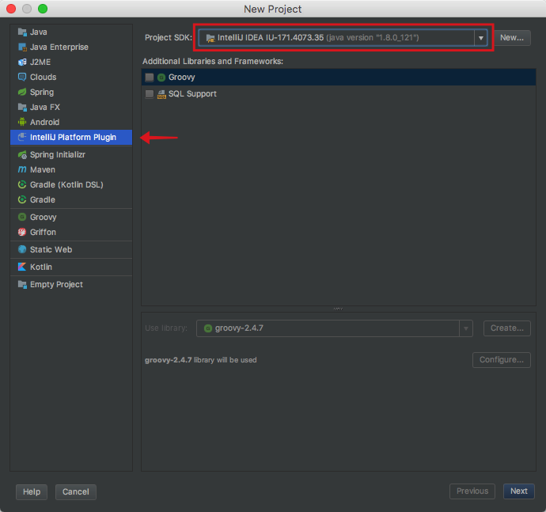
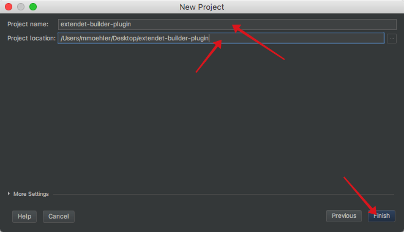
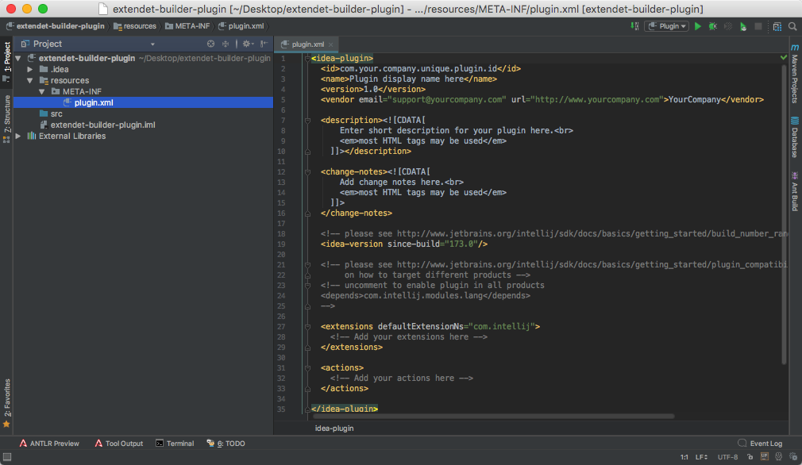
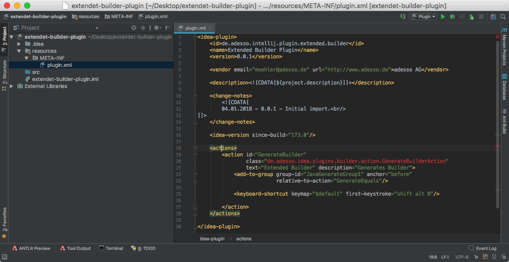
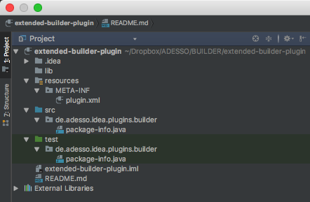

Dies ist der erste einer Reihe von Beiträgen, die sich mit der Entwicklung von [Intellij IDEA](https://de.wikipedia.org/wiki/IntelliJ_IDEA) Plugins beschäftigen. Diese Plugins können die tägliche Arbeit eines Entwicklers in erheblichem Maße unterstützen und tragen zur Steigerung der Effizienz seiner Arbeit bei. Hat nicht von uns jeder schon einmal die Erfahrung gemacht, was es bedeutet, in Integrationsprojekten eine endlos lange Datenstruktur auf eine andere Struktur abzubilden? Gähnend langweilig. Sicherlich haben wir dann versucht, durch die Benutzung vorhandener Bibliotheken oder selbst geschriebener Skripte unsere Qualen zu verringern. Eine weitere Möglichkeit, bei der es nicht nur darum geht, "Qualen zu verringern" sondern auch darum, ein klein wenig Spaß aufkommen zu lassen, ist die, die Möglichkeiten der eigenen IDE zu nutzen, um die sich ständig wiederholenden Prozesse zu automatisieren. Dieser Thematik widmet sich dieser und folgende Blog Beiträge.      

# Teil 01 - Definition der Anforderungen und Anlage des [Intellij IDEA](https://de.wikipedia.org/wiki/IntelliJ_IDEA) Plugin Projekts
In dieser ersten Folge beschäftigen wir uns mit folgenden Punkten:

* Aufnahme der Anforderungen für die Generierung des Codes der verschiedenen Builder und
* Aufsetzen des Projektes für die Implementierung des Plugins

Beginnen wir also mit der Aufnahme der Leistungsanforderungen für die zu generierenden Builder.

## Definition der Anforderungen
In diesem Abschnitt tragen wir die Anforderungen an den zu generierenden Code und die Bedienung des Plugins zusammen. Diese dienen uns später dann als Akzeptanzkriterien für die durchzuführenden Tests.

### Allgemeines

Der Generator soll für eine gegebene Klasse inklusive ihrer eingebetteten nicht anonymen Klassen, entsprechende Builder Klassen generieren.

**a) Vor der Generierung**

```java
public class TopLevelClass {
   private NestedClass nested

   public static class NestedClass {
      String string
   }
}
```
**b) Nach der Generierung**

```java
public class TopLevelClass {
   private NestedClass nested
   ...
   public static class Builder {
      private NestedClass nested
      ...
   }
   ...
   public static class NestedClass {
      String string
      ...
      public static class Builder {
         private NestedClass nested
         ...
      }
   ...
   }
}
```
**Anmerkung:** 
Es wurden alle erkannten Klassen für die Generierung von Builder Klassen freigeschaltet.

### Generierung von Getter Methoden

Der Generator soll 

  * wenn nicht vorhanden, Getter generieren und 
  * wenn vorhanden, Setter löschen

Ob ein Attribut optional oder mandatory ist, soll einstellbar sein. Im Falle, dass ein Attribute optional ist, soll der entsprechende Getter ein `java.util.Optional` zurück liefern. Ist ein Attribut mandatory, soll eine entsprechende Validierung bei der Datenübertragung vom Builder auf die neu erzeugte Objektinstanz in einem entsprechendem Constructor erfolgen. Wird in diesem Falle ein Nullwert übergeben, soll eine `IllegalArgumentException` mit Informationen zum regelverletzendem Attribute geworfen werden.

**a) Vor der Generierung**

```java
public class TopLevelClass {
   private NestedClass nested
   private String string
   ...
   public static class NestedClass {
      private String string
      private Integer integer
      ...
   }
   ...
}
```
**b) Nach der Generierung**

```java
public class TopLevelClass {
   // als optional markiert
   private NestedClass nested
   private String string
   ...
   private TopLevelClass(Builder builder) {
      this.nested = builder.nested
      if(null == builder.string) {
         throw new IllegalArgumentException(""string"");
      }
      this.string = Preconditions.checkNotNull(builder.string, "string");
   }
   ...
   public Optional<NestedClass> getNestedClass() {
      return Optional.ofNullable(this.nested);
   }
   
   public String getString() {
      return this.string;
   }
   ...
   public static class Builder {
      ...
   }
   ...
   public static class NestedClass {
      private String string
      private Integer integer
      ...
      private NestedClass(Builder builder) {
         this.string = builder.string
         this.integer = builder.integer
      }
      ...
      public String getString() {
         return this.string;
      }

      public String getString() {
         return this.string;
      }
      ...
      public static class Builder {
         ...
      }
   ...
   }
}
```
### Generierung von Standard- und NestedClass-Builder Klassen
Die Klassen, für die ein Builder generiert werden soll, sollen wählbar sein. Ebenso soll gesteuert werden können, ob für die jeweilige Klasse ein Standard- oder Nested-Builder generiert werden soll. Builder werden als innere Klassen bezogen auf die zu bauenden Klassen generiert.

Zuerst die Generierung von Standard Builder Klassen.

**a) Vor der Generierung**

```java
public class TopLevelClass {
   private NestedClass nested

   public static class NestedClass {
      String string
   }
}
```
**b) Nach der Generierung**

```java
public class TopLevelClass {
   private NestedClass nested
   ...
   public static class Builder {
      private NestedClass nested
      ...
      public static Builder newBuilder() {
         return new Builder(false);
      }
      
      private TopLevelClass(Builder builder) {
         ...
      }
      
      public Builder witNestedClass(NestedClass value) {
         this.nested = value;
         return this;
      }
      
      public NestedClass build() {
        return new TopLevelClass(this);
      }
      ...
   }
   ...
   public static class NestedClass {
      String string
      ...
      public static Builder newBuilder() {
         return new Builder(false);
      }

      private NestedClass(Builder builder) {
         ...
      }
      
      public static class Builder {
         private String string;
         
         public Builder withString(String value) {
            this.string = value;
         }
         
         public NestedClass build() {
            return new NestedClass(this);
         }
         ...
      }
   ...
   }
}
```

**c) Verwendung der Builder**

Die o.g. Generierung kann dann wie folgt verwendet werden:

```java
TopLevelClass top = TopLevelClass.newBuilder() 
   .withNestedClass(TopLevelClass.NestedClass.newBuilder
      .withString("a String")
      .build())
   .build();
```

Nun die Generierung von Nested Builder Klassen

**a) Vor der Generierung**

```java
public class TopLevelClass {
   private String name;
   private NestedClass nested;

   public static class NestedClass {
      String string;
   }
}
```
**b) Nach der Generierung**

```java
public class TopLevelClass {
   private NestedClass nested
   ...
   public static class Builder {
      private String name;
      private NestedClass nested
      ...
      public static Builder newBuilder() {
         return new Builder();
      }
      
      private TopLevelClass(Builder builder) {
         ...
      }
      
      public Builder withName(String value) {
         this.name = value;
         return this;
      }
      
      public Builder withNestedClass(NestedClass value) {
         this.nested = value;
         return this;
      }
```
Neben der oben zuletzt gezeigten Methode für das Setzen einer neuen Instanz von `NestedClass` wird im `Builder` nun zusätzlich eine Methode generiert, welche den `NestedClass.Builder` zurück liefert. Die Verwendung dieser Methode ermöglicht es, durchgehend "fluent" zu arbeiten.
Die Methode zum setzen einer `NestedClass` Instanz bleibt erhalten kann weiterhin genutzt werden. Gleichzeitig wird diese Methode innerhalb des nested Builder als Callback für das setzen der durch den  `NestedClass.Builder` erzeugten, neuen Instanz von `NestedClass` benötigt.
 
```java
      public NestedClass.Builder withNestedClass() {
         return modeCopy
            ? NestedClass.Builder.copyBuilder(this.nestedClass)
               .nestedIn(Builder.this, Builder.this::withNestedClass);
            : NestedClass.Builder.newBuilder()
               .nestedIn(Builder.this, Builder.this::withNestedClass);
      }      
      public NestedClass build() {
        return new TopLevelClass(this);
      }
      ...
   }
   ...
   public static class NestedClass {
      String string
      ...
      public static Builder newBuilder() {
         return new Builder();
      }

      private NestedClass(Builder builder) {
         ...
      }
      
      public static class Builder {
         private String string;
         private TopLevelClass parentBuilder;
         private Consumer<NestedClass> callback;
         
         public static Builder newBuilder() {
            return new Builder();
         }
```
Die folgende Methode initialisiert den `NestedClass.Builder` mit der benötigten Referenz auf den Parent Builder und einem Callback in den Parent Builder für das setzen der neuen Instanz.

```java
         public Builder nestedIn(TopLevelClass parentBuilder, Consumer<NestedClass> callback) {
            this.parentBuilder = parentBuilder;
            this.callback = callback;
            return this;
         }
         
         public Builder withString(String value) {
            this.string = value;
         }
```
Die Methode `NestedClass.Builder#end()` ist nun dafür zuständig, den Callback auszuführen und damit die durch den Aufruf der Methode `NestedClass.Builder#build()` neu erzeugte Instanz der Klasse `NestedClass` im Parent Builder zu setzen. Zusätzlich wird durch die Rückgabe der Parent Builder Instanz wird der Rücksprung in den Bearbeitungskontext der `TopLevelClass` sichergestellt.

```java
         public TopLevelClass.Builder end() {
            this.callback.accept(build());
            return this.parentBuilder;
         }
         
         public NestedClass build() {
            return new NestedClass(this);
         }
         ...
      }
   ...
   }
}
```

**c) Verwendung der Builder**

Die o.g. Generierung kann dann wie folgt verwendet werden:

```java
TopLevelClass top = TopLevelClass.newBuilder() 
   .withNestedClass()
      .withString("a String")
   .end()
   .build();
```

**Anmerkung:** 
Der in den verschiedenen Beispielen dargestellte Code ist vielleicht nicht ganz realistisch, er verdeutlicht jedoch die aufgestellten Anforderungen hinreichend. Für ein etwas praktikableres Beispiel - Siehe [Github Project]().

### Generierung einer `ClassBuilder.copyBuilder(Class original)` Methode 

Der Builder soll unveränderliche ValueObjects produzieren. Direkte Änderungen am Zustand dieser ValueObjects können also nicht durch geführt werden. Es ist aber durchaus möglich neue Instanzen aus vorhanden ValueObjects zu erzeugen und im Rahmen deren Initialisierung vorhandene Werte mit neuen, geänderten Werten zu überschreiben. Das dann zurückgelieferte ValueObject kann dann in der weiteren Implementierung wie ein geändertes Object verwendet werden.

**a) Vor der Generierung**

```java
public class TopLevelClass {
   private String name;
   private NestedClass nested;

   public static class NestedClass {
      String string;
   }
}
```
**b) Nach der Generierung**

```java
public class TopLevelClass {
   private String name;
   private NestedClass nested;

   public static Builder copyBuilder(TopLevelClass original) {
      Builder builder = new Builder(true);
      builder.name = original
      builder.nested = original.nested);
      return builder
   }
   ...
   public static class Builder {
      private final boolean modeCopy;
      ...
      public Builder(boolean modeCopy) {
        this.modeCopy = modeCopy;
      }
      ...
      public Builder withNestedClass(NestedClass value) {
         this.nested = value;
         return this;
      }

      public NestedClass.Builder withNestedClass() {
         return (modeCopy ? NestedClass.Builder.copyBuilder(this.nestedClass) : NestedClass.Builder.newBuilder()
         .nestedIn(Builder.this, Builder.this::withNestedClass);
      }
   } 
   ...
   public static class NestedClass {
      private String string;
          
      public static Builder copyBuilder(NestedClass original) {
         Builder builder = new Builder(true);
         builder.string = original.string
         return builder
      }
      ...
      public static class Builder {
         public Builder(boolean modeCopy) {
            this.modeCopy = modeCopy;
         }
         ...
      }
   }      
}
```

**c) Verwendung der `copyBuilder` Methode**

Die o.g. Generierung kann dann wie folgt verwendet werden:

```java
TopLevelClass top = TopLevelClass.newBuilder()
   .withName("Sample-01")
   .withNestedClass()
      .withString("a String")
   .end()
   .build();
   
// now modify the NestedClass::string property

top = TopLevelClass.copyBuilder(top)
   .withNestedClass()
      .withString("an other String")
   .end()
   .build();
```
Damit sind wir am Ende unserer Anforderungsliste. Weiter geht es jetzt mit der Anlage des Plugin Projektes in der [IntelliJ IDEA](https://de.wikipedia.org/wiki/IntelliJ_IDEA) IDE.

## Einrichtung des [IntelliJ IDEA](https://de.wikipedia.org/wiki/IntelliJ_IDEA) Plugin Projekts

Für das Anlegen des Projektes müssen folgende Arbeitsschritte in der angegebenen Reihenfolge durchgeführt werden:

**Schritt 01:**



Ein neues Projekt wird durch einen Klick auf den mit einem roten Pfeil gekennzeichneten Link erzeugt. Nach dem Klick wird der "New Project" Dialog angezeigt.

**Schritt 02:**



In diesem Dialog muß in der Auswahlliste auf der linken Seite des Dialogs der Eintrag _'IntelliJ Platform Plugin'_ ausgewählt werden. Sonst sind keine weiteren Optionen zu markieren oder auszuwählen. Es wird fortgefahren mit einem Klick auf den Button _'Next'_. Es öffnet sich der Dialog _'New Project'_ mit dem Panel für die Definition des Namens des Projekts und der Projekt-Location.

**Wichtig!**
Es ist unbedingt darauf zu achten, dass im Feld _'Project SDK:'_ ein gültiges, java 8 SDK basiertes IntelliJ SDK ausgewählt ist. Ist dies nicht der Fall, ist ein entsprechendes auszuwählen. Ist eine Auswahl nicht möglich, ist ein neues anzulegen. Dies geschieht durch einen Klick auf den Button _'New'_. Danach ist den entsprechenden Anweisungen zu folgen.

**Schritt 03:**



In diesem Dialog ist der Projektname und der Speicherort des Projektes in den entsprechenden Feldern zu definieren. Ein Klick auf den Button _'Finish'_ beendet den ersten Teil der Erzeugung unseres Projektes. 

Wird nach dem Klick auf den Button _'Finish'_ eine Sicherheitsabfrag, bezüglich der Genehmigung der Anlage von nicht existierenden Dateien und Verzeichnissen angezeigt, kann diese angenommen werden.

Es wird die Entwicklungsumgebung geöffnet. 

**Schritt 04:**



Angezeigt wird hier die Datei `plugin.xml`. Diese Datei ist ähnlich wie bei einem Eclipse Plugin die zentrale Konfigurationsdatei eines Plugins in die IDE. Für nähere Informationen zu dieser Datei und den Möglichkeiten ihrer Gestaltung - Siehe: [Plugin Konfiguration File - plugin.xml](https://www.jetbrains.org/intellij/sdk/docs/basics/plugin_structure/plugin_configuration_file.html).

Der Inhalt der Datei ist durch den folgenden Text zu ersetzen:

```xml
<idea-plugin>
  <id>de.adesso.intellij.plugin.extended.builder</id>
  <name>Extended Builder Plugin</name>
  <version>0.0.1</version>
  
  <vendor email="moehler@adesso.de" url="http://www.adesso.de">adesso AG</vendor>

  <description><![CDATA[${project.description}]]></description>

  <change-notes><![CDATA[
        04.01.2018 - 0.0.1 - Initial import.<br/>
  ]]></change-notes>

  <idea-version since-build="173.0"/>

  <actions>
      <action id="GenerateBuilder" 
              class="de.adesso.idea.plugins.builder.action.GenerateBuilderAction"
              text="Extended Builder" description="Generates Builder">
          <add-to-group group-id="JavaGenerateGroup1" anchor="before" 
                        relative-to-action="GenerateEquals"/>
	  
	        <keyboard-shortcut keymap="$default" first-keystroke="shift alt B"/>
    
      </action>
  </actions>

</idea-plugin>
```

Die Entwicklungsumgebung sollte danach wie folgt aussehen:



Nach dem Eintragen wird die Klassendefinition für die Entry Action des Plugins als Fehler rot gekennzeichnet sein. Dies hängt damit zusammen, dass diese Klasse im Moment noch nicht definiert ist. Wie wir dieses rot in ein sattes grün umwandeln, wird in der nächsten Folge beschrieben. Fürs erste nehmen wir das einmal so hin und gehen zum nächsten und letzten Schritt über.

**Schritt 04:**

Der letzte Schritt befasst sich nun mit dem Aufsetzen einer **vorläufigen Verzeichnisstruktur und der Anlage von von benötigten (leeren) Dateien**.

Ausgangssituation ist hierbei folgende:


Jetzt sind die entsprechenden Anpassungen vorzunehmen. Danach sollte die Struktur wie folgt aussehen:



Und damit sind wir am Ende der aktuellen Session. In der nächsten Folge des Blogs 
* kümmern wir uns um die Vervollständigung der Projektstruktur 
* Konzipieren die Bausteine des Builders und beginnen mit der Implementierung.

## Hilfreiche Links in Vorbereitung auf die nächste Folge

* [IntelliJ Platform SDK DevGuide](https://www.jetbrains.org/intellij/sdk/docs/basics.html)

