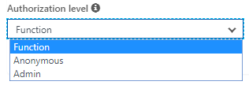
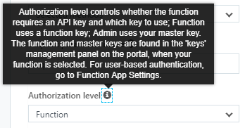
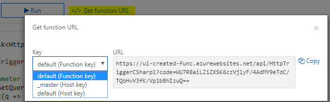
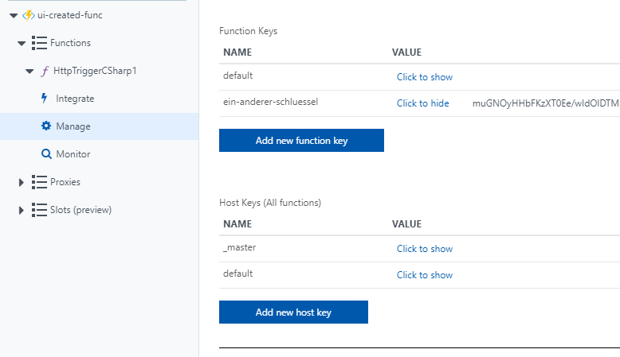
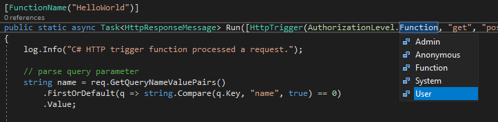
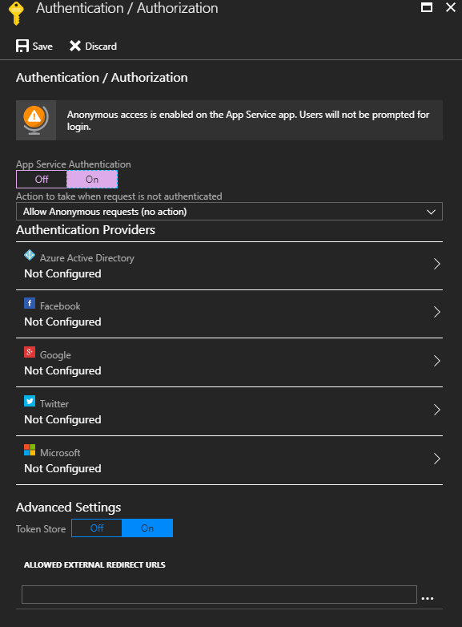

Gibt es "Sicherheit" bei azure functions? Sind diese immer Öffentlich zugänglich? Können functions mit Benutzer-Autorisierung abgesichert werden? Dieser Beitrag versucht der Frage nachzugehen und eine Lösung aufzuzeigen.

# Übersicht
Eine function ist in azure leicht erstellt. Ein einfaches Beispiel liefert Microsoft schon in der [Dokumentation](https://docs.microsoft.com/en-us/azure/azure-functions/functions-create-first-azure-function) mit. Zum aktuellen Zeitpunkt hat die Dokumentation exakt 10 Schritte, beginnend mit "Create a function app" bis abschließend mit "Test the function".
Es stellt sich die Frage, ob diese function dann auch schon "abgesichert" ist.

Eine function besteht grob aus zwei Teilen: Aus der ["Azure Function"](https://docs.microsoft.com/en-us/azure/azure-functions/) selbst und dem ["Azure App Service"](https://docs.microsoft.com/en-us/azure/app-service/) in dem die function existiert. Dies führt dazu, dass man zwei Punkte betrachten muss, wenn es um die Frage der Sicherheit geht: Zum einen den App Service und zum anderen die function. 

## Sicherheit in functions
Die Fragestellung nach der "Sicherheit der function" ist etwas verwirrend - im Grunde soll ja nicht die function abgesichert werden, sondern der Aufruf bzw. der Start der function. Functions starten immer über sogenannte Trigger, von denen die meisten Azure-Intern zu verwenden sind (z.B. Timer, Event Hub oder Blob Storage). Der für  diesen Artikel betrachtete Trigger ist der [HTTP oder "generic web hook"-Trigger](https://docs.microsoft.com/en-us/azure/azure-functions/functions-create-generic-webhook-triggered-function).

Lauf [Doku](https://docs.microsoft.com/en-us/azure/azure-functions/functions-bindings-http-webhook#trigger---configuration) stehen drei Authorisierungsmechanismen auf Ebene der functions zur Verfügung:

 - `anonymous` - No API key is required.
 - `function` - A function-specific API key is required. This is the default value if none is provided.
 - `admin` - The master key is required.

 
 
Diese Funktion lässt es also zu, den Aufruf der function über einen Schlüssel (oder "key") abzusichern. Wie sieht das genau aus:

Zuerst muss der Schlüssel abgerufen werden:

Die Schlüssel haben natürlich auch eine Verwaltungsoberfläche:

Die Schlüssel können über zwei verschiedene Mechanismen verwendet werden. Entweder als Query-Parameter:

    https://<yourapp>.azurewebsites.net/api/<function>?code=<ApiKey>

Oder als `x-functions-key` HTTP-Header.

Auf Ebene einer mit Code erstellen function lässt sich noch eine weitere Methode finden: *User*

Dieses feature ist aber - obwohl hier auswählbar - zum Zeitpunkt dieses Beitrags noch nicht verfügbar. (Der Status des features kann in einem [Github-Issue](https://github.com/Azure/azure-functions-host/issues/33) eingesehen werden.) Eine Benutzer-Autorisierung scheint auf Ebene der Functions also nicht möglich. 

## Sicherheit im app service
 

todo todo todo

# Linksammlung
ACHTUNG ACHTUNG ACHTUNG ACHTUNG  
*das hier muss alles noch weg!*    
ACHTUNG ACHTUNG ACHTUNG ACHTUNG 

* https://github.com/nils-a/function-security-blog
* https://azure.microsoft.com/de-de/blog/introducing-azure-functions/
* https://blogs.msdn.microsoft.com/appserviceteam/2016/04/27/azure-functions-the-journey/
* 
 

# Die alternative zu "user"

hier viel code...

todo todo todo