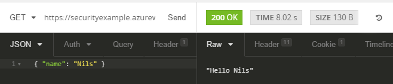
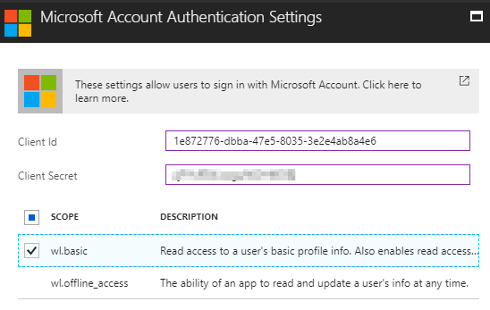
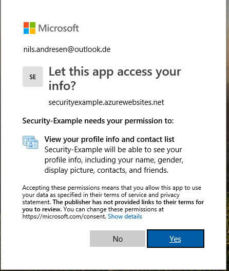
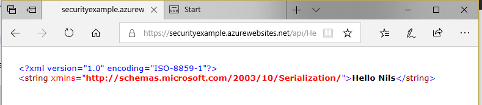

Gibt es "Sicherheit" bei azure functions? Sind diese immer Öffentlich zugänglich? Können functions mit Benutzer-Autorisierung abgesichert werden? Dieser Beitrag versucht der Frage nachzugehen und eine Lösung aufzuzeigen.

# Übersicht
Eine function ist in azure leicht erstellt. Ein einfaches Beispiel liefert Microsoft schon in der [Dokumentation](https://docs.microsoft.com/en-us/azure/azure-functions/functions-create-first-azure-function) mit. Zum aktuellen Zeitpunkt hat die Dokumentation exakt 10 Schritte, beginnend mit "Create a function app" bis abschließend mit "Test the function".
Es stellt sich die Frage, ob diese function dann auch schon "abgesichert" ist.

Eine function besteht grob aus zwei Teilen: Aus der ["Azure Function"](https://docs.microsoft.com/en-us/azure/azure-functions/) selbst und dem ["Azure App Service"](https://docs.microsoft.com/en-us/azure/app-service/) in dem die function existiert. Dies führt dazu, dass man zwei Punkte betrachten muss, wenn es um die Frage der Sicherheit geht: Zum einen den App Service und zum anderen die function. 

## Sicherheit in functions
Die Fragestellung nach der "Sicherheit der function" ist etwas verwirrend - im Grunde soll ja nicht die function abgesichert werden, sondern der Aufruf bzw. der Start der function. Functions starten immer über sogenannte Trigger, von denen die meisten Azure-Intern zu verwenden sind (z.B. Timer, Event Hub oder Blob Storage). Der für  diesen Artikel betrachtete Trigger ist der [HTTP oder "generic web hook"-Trigger](https://docs.microsoft.com/en-us/azure/azure-functions/functions-create-generic-webhook-triggered-function).

Lauf [Doku](https://docs.microsoft.com/en-us/azure/azure-functions/functions-bindings-http-webhook#trigger---configuration) stehen drei Authorisierungsmechanismen auf Ebene der functions zur Verfügung:

 - `anonymous` - No API key is required.
 - `function` - A function-specific API key is required. This is the default value if none is provided.
 - `admin` - The master key is required.

 
 
Diese Funktion lässt es also zu, den Aufruf der function über einen Schlüssel (oder "key") abzusichern. Wie sieht das genau aus:

Zuerst muss der Schlüssel abgerufen werden:

Die Schlüssel haben natürlich auch eine Verwaltungsoberfläche:

Die Schlüssel können über zwei verschiedene Mechanismen verwendet werden. Entweder als Query-Parameter:

    https://<yourapp>.azurewebsites.net/api/<function>?code=<ApiKey>

Oder als `x-functions-key` HTTP-Header.

Auf Ebene einer mit Code erstellen function lässt sich noch eine weitere Methode finden: *User*

Dieses feature ist aber - obwohl hier auswählbar - zum Zeitpunkt dieses Beitrags noch nicht verfügbar. (Der Status des features kann in einem [Github-Issue](https://github.com/Azure/azure-functions-host/issues/33) eingesehen werden.) Eine Benutzer-Autorisierung scheint auf Ebene der Functions also nicht möglich. 

## Sicherheit im app service

In den Einstellungen des App Service ("Plattformeinstellungen", aus sicht der function) gibt es den Punkt "Authentication/Authorization":
 

Hier ist erkennbar, dass zumindest eine Benutzer-Authentifizierung möglich ist.
Die aktuellen anbieter für Authentifizierung sind unter anderem "Microsoft" und "Azure Active Directory" - dies ist zu unterscheiden, da für den "Microsoft"-Anbieter ein einfacher [Microsoft-Account](https://account.microsoft.com/) verwendet wird, wohingegen für Azure Active Directory eben dies (einen Account in einem Azure Active Directory) meint.  

Zusätzlich ist einstellbar, ob unauthentifizierte Zugriffe erlaubt sein sollen oder ob diese an einen der angegebenen Authentifizierungsanbieter umgeleitet werden sollen.

Den Ablauf der Authentifizierung ein einem App Servive stellt die entsprechende [Doku](https://docs.microsoft.com/en-us/azure/app-service/app-service-authentication-overview#authentication-flow) gut dar. Grob vereinfacht sieht der Ablauf wie folgt aus:

1. Anmeldung : Der Benutzer Authentifiziert sich an einem Authentifizierungsanbieter. Das Ergebnis ist ein Beweis (token) des Authentifizierungs-Anbieters.
2. Validierung : Der Beweis der Authentifizierungsanbieter wird an den App Service gesendet und dort geprüft. Das Ergebnis ist ein Beweis des App Service.
3. Verwendung : Der Beweis des App Service wird für Aufrufe der function verwendet.

# Autorisierung und Authentifizierung von Benutzern am Beispiel

Als Ausgangspunkt wird eine einfache function, wie sie z.B. in [diesem Projekt](https://github.com/nils-a/function-security-blog/blob/4459770832d74c17ce1455b5fcb340a274759c75/SecurityExample/SecurityExample/HelloWorld.cs) definiert ist verwendet.

Der Aufruf einer solchen function ist in den meisten tools relativ simpel:

Als ersten Schritt in der einrichtung einer Authentifizierung wird der function-Aufruf auf "Anonym" gestellt:

	HttpTrigger(AuthorizationLevel.Anonymous ....

und statt dessen ein Authentifizierungsanbieter eingerichtet:
Dieser Schritt wird begonnen mit der Einrichtung direkt am Authentifizierungsanbieter. Dieses beispiel verwendet den "Microsoft"-Authentifizierungsanbieter.

1. unter [https://apps.dev.microsoft.com/](https://apps.dev.microsoft.com/) muss eine "App" eingerichtet werden. D.h. eine Anwendung gegen die die Authentifizierung erfolgt.
	1. Für die Anwendung muss ein Anwendungsgeheimnis eingerichtet werden
	2. Und eine Plattform: Web (für die Anmeldung mit der automatischen Weiterleitung). Die Umleitungs-URL für die Plattform ist anhand der [Doku](https://docs.microsoft.com/en-us/azure/app-service/app-service-authentication-overview#identity-providers) zu ermitteln: In diesem Fall ist es `https://<yourapp>.azurewebsites.net/.auth/login/microsoftaccount/callback` (Achtung: Entgegen der Doku ist die URL wirklich `.../microsoftaccount/...` und nicht `.../microsoft/...`.) 
2. Anwendungs-ID und -geheimnis müssen in azure für den Authentifizierungsanbieter hinterlegt werden und es muss mindestens der Bereich "wl.basic" ausgewählt werden:
   
      

	  Zusätzlich sollten unauthentifizierte Anfragen an den Microsoft-Authentifizierungsanbieter umgeleitet werden.
      Mit dieser änderung kann die function schon nicht mehr "einfach" z.B. über tools/einfache rest-abfragen abgerufen werden.

      Dafür ist es jetzt möglich die function über den Browser anzusprechen - ohne code-Parameter in der URL, dafür mit Anmeldung:

      

      

todo todo todo
todo todo todo
todo todo todo

# Achtung

ACHTUNG ACHTUNG ACHTUNG ACHTUNG  
*das hier muss alles noch weg!*    
ACHTUNG ACHTUNG ACHTUNG ACHTUNG 

# offene Schritte:

* function umbauen, sodass User-Infos aus Graph kommen (bzw. vom Authentifizierungsanbieter...)
* rest & Desktop-App zugriffe "ermöglichen" 
* Auf Authorisation eingehen im gegensatz zu Authentikation
* Alternativen? (
* Auth0?)
