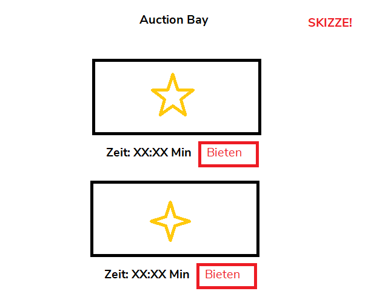
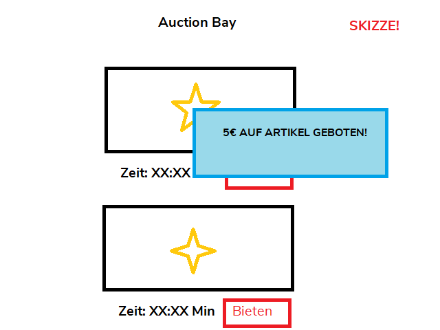
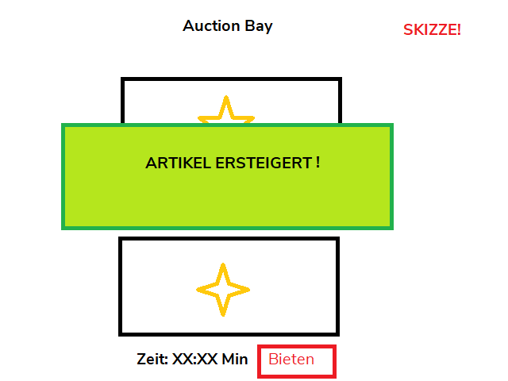

In diesem praktischen Blogpost betrachten wir ein Beispiel zur Implementierung einer WebSocket Verbindung zwischen einem JavaScript Client und einer Spring Boot Applikation.

# Das Problem
Perfomante Bereitstellung aktueller Informationen ist ein unerlässlicher Bestandteil von Anwendungen wie beispielsweise Messengern, Wetterdiensten oder Newstickern.
Trotz des generell hohen Informationsflusses sind Aktualisierungsintervalle zwischen Client und Server jedoch nicht fest definiert und bei zeitkritischen Anwendungen somit schwer zu bestimmen.

Da REST Verben auf dem HTTP [Request/ Response Muster](https://www.webnots.com/what-is-http/) basieren, initiieren sie nur temporäre Verbindungen.
Somit sind sie der Anforderung eines steten Informationsaustausches ungenügend.

## Die Lösung
Die Lösung der Anforderung gelingt durch Einsatz der 2011 entwickelten [WebSocket](https://tools.ietf.org/html/rfc6455) Technologie.

### WebSocket
Mittels des [Protocol Upgrade Mechanism](https://developer.mozilla.org/en-US/docs/Web/HTTP/Protocol_upgrade_mechanism)s etabliert das Protokoll gewöhnliche HTTP Verbindungen zu bidirektionalen Kommunikationswegen.

### STOMP
Als Erweiterungsprotokol liefert [STOMP](https://stomp.github.io/) (Simple Text Oriented Messaging Protocol) uns Funktionalitäten die analog zum [Beobachter-Muster](https://docs.microsoft.com/en-us/azure/architecture/patterns/publisher-subscriber) sind.

### Das Beobachter-Muster
Das Prinzip dieses Entwurfsmusters ermöglicht Informationsempfängern gegebene Nachrichtenkanäle zu abonnieren und Meldungen **dann** zu erhalten, **wenn** sie bereitstehen.


Stellt man sich unsere Clients bzw. Informationsempfänger als Zeitungsverläge vor, wäre es für sie unwirtschaftlich und mühsam ihre Journalisten ständig nach Neuigkeiten fragen zu müssen.
Wenn die Journalisten sich hingegen selbst melden **sobald** sie etwas zu berichten haben, profitieren beide Parteien.

## Die Beispielanwendung
Weil das Internet genug Beispiele für Chatprogramme gesehen hat, stellt unsere exemplarische Anwendung eine Auktionsplattform dar.
Die Clientoberfläche wurde mit [Angular](https://angular.io) entwickelt, während Java [Spring Boot](https://spring.io) die Serverlogik trägt.
Nach kurzer Erläuterung der verwendeten Technologien betrachten wir die Anwendung als gegeben und verzichten auf Implementierungsdetails.

<p align="center">
  Der vollständige <a href="https://github.com/s-gbz/WebSocketAuctionExample">Quellcode ist auf GitHub</a> zu finden.
</p>

### Angular
Angular ist ein führendes, von Google geführtes, Open Source Framework zur Entwicklung von Webanwendungen.
Es überzeugt durch eine vollständig abgedeckte [Feature-Landschaft](https://angular.io/features) und Unterstützung von [TypeScript](https://www.typescriptlang.org/).

*Die Umsetzung des Socketclients ist nicht an Angular gebunden und kann mit reinem JavaScript beliebig reproduziert werden.* 

### Spring Boot
Spring Boot ist ein Java Framework, das durch schnelle und entwicklerfreundliche Umsetzung von Enterprise Applikationen gekennzeichnet ist.

# Implementierung des Clients
Die Oberfläche der Auktionsplattform bietet Nutzern folgende Anwendungsfälle, die mit WebSockets behandelt werden:

- A. Darstellung von Auktionsartikeln



- B. Gebotserstellung Auktionsartikeln



- C. Kauf von Auktionsartikeln



Die Implementierung der Anwendungsfälle erfolgt in `src/app/auction-view/auction-view.component.ts`.

## Vorbereitung auf Clientseite
Um WebSockets in unser präpariertes Angular Projekt einzubinden, müssen wir zuvor die anfallenden Abhängigkeiten installieren.

### Installation des WebSockets
Da WebSockets zum [HTML Standard](https://html.spec.whatwg.org/multipage/web-sockets.html) gehören, ist das Interface in den meisten Browsern bereits verfügbar, womit externe Installationsschritte entfallen.
Browserkompatibilität kann in der offiziellen [Mozilla Dokumentation](https://developer.mozilla.org/en-US/docs/Web/API/WebSocket) geprüft werden.

### Installation von STOMP
Um die Annemlichkeiten von [STOMP.js](https://www.npmjs.com/package/@stomp/stompjs) verwenden zu können, installieren wir die Bibliothek mit dem [Node Paketmanager](https://www.w3schools.com/whatis/whatis_npm.asp).

```bash
$ npm install stompjs @types/stompf net --save
```

Neben der Hauptbibliothek installieren wir somit auch die TypeScript Typisierung `@types/stompf` und die Abhängigkeit `net` für asynchrone Netzwerkaufrufe.

### Import von STOMP in Angular
Nach Installation der Pakette, folgt der Import innerhalb der Angularapplikation.

```typescript
import * as Stomp from 'stompjs';
...

export class AuctionViewComponent implements OnInit, OnDestroy {
  ...
```

Vor der Klassendefinition importieren wir in `AuctionViewComponent` den gesamten Inhalt von `stompjs` mit dem Prefix `Stomp`.

### Anlegen von Klassenvariablen
Anschließend legen wir Klassenvariablen für `WebSocket` und `Stomp.Client` an, die wir im Verlauf des Programms instanziieren werden.

```typescript
export class AuctionViewComponent implements OnInit, OnDestroy {

  webSocket: WebSocket;
  client: Stomp.Client;
  auctionItems: AuctionItem[] = [];
  
  ...
```

`auctionItems` ist hierbei unsere lokale Liste zu erwerbender Auktionsgegenstände.
Wir möchten diese Liste mit dem Server sowie unseren Mitbietern synchron halten.

### Aufruf im Konstruktor
Wenn ein Nutzer die Anwendung startet, wird unsere Angularkomponente initialisiert. 

```typescript
...
auctionItems: AuctionItem[] = [];

ngOnInit() {
  this.openWebSocketConnection();
  this.initializeAuctionItems();
}
```

Sobald die Komponente verfügbar ist, rufen wir die Methode zum Öffnen der WebSocket Verbindung auf.  
Im Anschluss fragen wir verfügbare Auktionsartikel vom Server ab, um `auctionItems` zu initialisieren.
Dieser Teil des Codes deckt Use Case A.

## Öffnen der Verbindung 
Um den WebSocket samt STOMP zu starten, betrachten wir folgende Methode der Klasse `AuctionViewComponent`.

```typescript
ngOnInit() { ... }

openWebSocketConnection() {
  this.webSocket = this.httpService.getWebSocket();

  this.client = Stomp.over(this.webSocket);

  this.client.connect({}, () => {
    this.client.subscribe("/item-updates", (item) => {
      this.insertOrUpdateItem(JSON.parse(item.body));
    });
  });
}
```

### WebSocket Verbindung öffnen
Zunächst wird eine WebSocket Instanz vom `httpService` bereitgestellt.

```typescript
this.webSocket = this.httpService.getWebSocket();
...
```

Das geschieht indem innerhalb von `src/app/http.service.ts` eine [Singletoninstanz](https://angular.io/guide/singleton-services) angelegt wird. 

```typescript
getWebsocket(): WebSocket {
  return new WebSocket("ws://localhost:8080/socket-registry");
}
```

In der gesamten Angularanwendung steht somit nur **ein** WebSocket zur Verfügung.
Wir verwenden dieses gängige Entwurfsmuster, um Mehrfachverbindungen des Clients zu vermeiden.
Zu beachten ist, dass die URL des WebSockets grundsätzlich mit `ws://` oder im Fall einer verschlüsselten Verbindung mit `wss://` beginnen muss.

### STOMP Verbindung öffnen
Zurück in `openWebSocketConnection()` rufen wir STOMP auf, indem wir die Instanz des WebSockets im Konstruktor übergeben.

```typescript
...
this.client = Stomp.over(this.webSocket);
...
```

Die STOMP Instanz `this.client` verbindet sich mittels der `connect` Methode anschließend mit dem Server.

```typescript
...
this.client.connect({}, () => {
  ...
```

Wenn der Verbindungsaufbau erfolgreich war, folgt der [Callback]([https://some-url](https://developer.mozilla.org/en-US/docs/Glossary/Callback_function)) der `this.client.connect` Methode.

### Callbacks
Da Kommunikation im Internet mit Latenzen (Wartezeiten) verbunden ist, kann kein zeitlich synchroner Programmablauf garantiert werden.
Webanwendungen müssen auf Ereignisse flexibel reagieren können, indem sie einzelne Programmteile asynchron (verzögert) ausführen.
**Callbacks dienen im JavaScript der Ausführung solch asynchroner Anweisungen.** 

Ihre Schreibweise folgt dem Muster

```typescript
this.asynchroneMethode({}, () => {
  // Asynchroner Code
  ...
```

### Abonnieren von STOMP Kanälen
Im Callback von `this.client.connect`, abonniert der Client den Kanal `"/item-updates"`.

```typescript
...
this.client.subscribe("/item-updates", (item) => {
  this.insertOrUpdateItem(JSON.parse(item.body));
  ...
}
```

Im Callback von `this.client.subscribe` erhalten wir mittels `item` aktuelle Neuerungen eines Auktionsgegenstandes.
`this.insertOrUpdateItem` passt die lokale Liste der Gegenstände hinsichtlich der Änderungen an.
Mögliche Änderungen umfassen das Hinzufügen, Entfernen oder die Preisanpassung eines Artikels.

## Schließen der Verbindung
Um unnötige Verbindungen zu meiden, lassen wir sie schließen sobald der Nutzer die Anwendung verlässt.

```typescript
ngOnDestroy() {
  this.closeWebSocketConnection();
}

closeWebSocketConnection() {
  if (this.client) {
    this.webSocket.close();
    this.client.unsubscribe("/item-updates");
  }
}
```

Um Fehler zu vermeiden, prüfen wir mit `if (this.client)` ob eine STOMP Verbindung besteht.
Falls ja, impliziert dies eine aktive WebSocket Verbindung die wir mittels `this.webSocket.close();` beenden.
`this.client.unsubscribe("/item-updates")` kündigt letztlich das Abonnement des Nachrichtenkanals. 

## Versenden von Nachrichten
Nachdem wir Use Case A. abgedeckt haben und unsere Anwendung nun Auktionsgegenstände anzeigen kann, gilt es mit den Fällen B. und C. fortzufahren.
Diese umfassen die Abgabe eines Bietgebots und das Ersteigern von Gegenständen.
Die hierfür notwendige Funktionalität ist das Benachrichtigen der Teilnehmer, dass der Preis eines Artikels gestiegen ist. 

```typescript
updateItemAndSendBid(item: AuctionItem) {
  this.httpService.updateItem(item).subscribe((success: boolean) => {
    console.log(`Update for ${item} was ${success}`);
  });

  this.client.send("/item-updates", {}, JSON.stringify(item));
}
```

Zunächst aktualisieren wir die Datenbank des Servers indem unser `httpService` die `updateItem(item)` Methode aufruft und eine [POST Anfrage](https://www.w3schools.com/tags/ref_httpmethods.asp) mit dem neuen Preis des Artikels versendet.
Der anschließende Callback von `subscribe` teilt uns zu Demonstrationszwecken den Erfolg der Operation in der Konsole mit.

`this.client.send` benachrichtigt alle Beobachter der Auktion, dass eine Änderung bereitsteht.
`"/item-updates"` ist hierbei der Kanal auf dem Nachrichten bzgl. den Auktionsgegenständen gesendet werden.
Wir verwenden `JSON.stringify(item)` um unser binäres Objekt in das portable Textformat [JSON](https://www.json.org/) zu konvertieren.

Anwendungsfall C. bzw. das finale Ersteigern eines Gegenstandes erfolgt automatisch bei Ablauf der Auktionszeit.
Die Implementierung basiert auf gewöhnlicher Logik und ist nur hinsichtlich der Vollständigkeit enthalten, weshalb wir keine Details dessen hier beleuchten. 

# Implementierung des Servers
Nach Fertigstellung des Spring Boot Boilerplatecodes (Objekte, Repositories und Controller), folgt die eigentliche Implementierung der WebSocket Schnittstelle.

## Vorbereitung
Abhängigkeiten im Gradlefile umfassen, abgesehen von den datenbankbezogenen Abhängigkeiten wie `data-jpa` und `h2 `, `web` und `websocket`.  

```gradle
dependencies {
	implementation 'org.springframework.boot:spring-boot-starter-data-jpa'
	implementation 'org.springframework.boot:spring-boot-starter-web'
	implementation 'org.springframework.boot:spring-boot-starter-websocket'
	runtimeOnly('com.h2database:h2')
	testCompile group: 'com.h2database', name: 'h2', version: '1.4.199'
	testImplementation 'org.springframework.boot:spring-boot-starter-test'
}
```

Um initiale Auktionsgegenstände in unserer Datenbank aufzuweisen, fügt ein SQL Skript diese beim Start der Anwendung ein.

```sql
INSERT INTO AUCTION_ITEM (id, current_bid, top_bid, new_bid, time_left, name, description) VALUES
  (1, 0, 20, 20, 10, 'Osterhase', 'Der Plüschklassiker zu Ostern!'),
  (2, 0, 10, 10, 300, 'Rostiges Messer', 'Ein Messer das dem Zahn der Zeit nicht trotzen konnte.'),
  ...
```

## Konfiguration des WebSockets
`@Configuration` und `@EnableWebSocketMessageBroker` markieren die Klasse als zu verwendende Konfiguration für den WebSocket des Servers.

```java
@Configuration
@EnableWebSocketMessageBroker
public class WebSocketConfig implements WebSocketMessageBrokerConfigurer {

  // Endpoint for client registry
  @Override
  public void registerStompEndpoints(StompEndpointRegistry registry) {
    registry.addEndpoint("/socket-registry").setAllowedOrigins("*");
  }

  // Endpoint for client topic subscription
  @Override
  public void configureMessageBroker(MessageBrokerRegistry registry) {
    registry.enableSimpleBroker("/item-updates");
  }
}
```

## Endpunkt für Clientregistierung
Clients die den Endpunkt `"/socket-registry"` aufrufen, initiieren eine bidirektionale Verbindung mit dem Server.
`setAllowedOrigins("*")` ermöglicht unserer WebSocket Klasse die Kommunikation mit Clients indem sie alle [Cross Origin Anfragen](https://developer.mozilla.org/en-US/docs/Web/HTTP/CORS) akzeptiert.

```java
@Override
public void registerStompEndpoints(StompEndpointRegistry registry) {
  registry.addEndpoint("/socket-registry").setAllowedOrigins("*");
}
```

## Endpunkt für Benachrichtigungen
Die Methode `configureMessageBroker` folgt ihrer Namensgebung und ermöglicht mittels der `MessageBrokerRegistry` sogenannte MessageBroker bzw. Nachrichtenvermittler zu definieren.
Diese Nachrichtenkanäle beziehen sich auf jeweils eine Fachlichkeit und können von Clients nach Bedarf abonniert werden.
So folgen alle Clients unseres Auktionshauses `"/item-updates"`, um über Änderungen hinsichtlich der Auktionsgegenstände benachrichtigt zu werden.

```java
@Override
public void configureMessageBroker(MessageBrokerRegistry registry) {
  // One channel:
  registry.enableSimpleBroker("/item-updates"); 
}
```

Es ist möglich mehrere MessageBroker bzw. Kanäle zu registrieren.

```java
@Override
public void configureMessageBroker(MessageBrokerRegistry registry) {
  // Multiple channels:
  registry.enableSimpleBroker("/update-items", "/another-channel", "...");
}
```

# Fazit
Mit Hilfe von STOMP.js und der nativen WebSocket Implementierung konnten wir clientseitig eine flexible und leichtgewichtige Nutzerapplikation bauen. Trotz der Vorzüge in Angular und somit TypeScript zu entwickeln, ist das Prinzip auf jedes beliebige Framework und reines JavaScript übertragbar.

Mit Spring Boot und [starter-websocket](https://mvnrepository.com/artifact/org.springframework.boot/spring-boot-starter-websocket) konnten wir eine leicht zu implementierende und effektive Schnittstelle auf Serverseite realisieren.