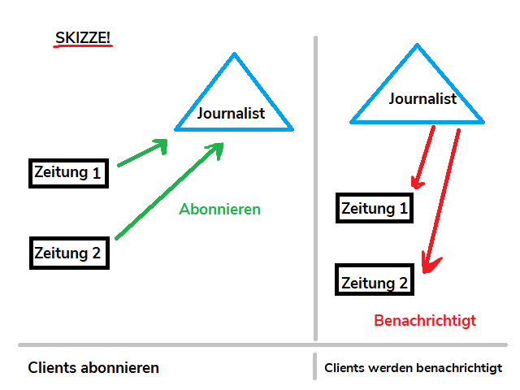

In diesem praktischen Blogpost betrachten wir ein Beispiel zur Implementierung einer WebSocket Verbindung zwischen einem JavaScript Client und einer Spring Boot Applikation.

# Das Problem
Perfomante Bereitstellung aktueller Informationen ist ein unerlässlicher Bestandteil von Anwendungen wie beispielsweise Messengern, Wetterdiensten oder Newstickern.
Trotz des generell hohen Informationsflusses sind Aktualisierungsintervalle zwischen Client und Server jedoch nicht fest definiert und bei zeitkritischen Anwendungen somit schwer zu bestimmen.

Da REST Verben auf dem HTTP [Request/ Response Muster](https://www.webnots.com/what-is-http/) basieren, initiieren sie nur temporäre Verbindungen.
Somit sind sie der Anforderung eines steten Informationsaustausches ungenügend.

## Die Lösung
Die Lösung der Anforderung gelingt durch Einsatz der 2011 entwickelten [WebSocket](https://tools.ietf.org/html/rfc6455) Technologie.

### WebSocket
Mittels des [Protocol Upgrade Mechanism](https://developer.mozilla.org/en-US/docs/Web/HTTP/Protocol_upgrade_mechanism)s etabliert das Protokoll gewöhnliche HTTP Verbindungen zu bidirektionalen Kommunikationswegen.

### STOMP
Als Erweiterungsprotokol liefert [STOMP](https://stomp.github.io/) (Simple Text Oriented Messaging Protocol) uns Funktionalitäten die analog zum [Beobachter-Muster](https://docs.microsoft.com/en-us/azure/architecture/patterns/publisher-subscriber) sind.

### Das Beobachter-Muster
Das Prinzip dieses Software-Patterns ermöglicht Informationsempfängern Nachrichtenkanäle zu abonnieren und Meldungen **dann** zu erhalten, **wenn** sie bereitstehen.



Stellt man sich unsere Clients bzw. Informationsempfänger als Zeitungsverläge vor, wäre es für sie unwirtschaftlich und mühsam ihre Journalisten ständig nach Neuigkeiten fragen zu müssen.
Wenn die Journalisten sich hingegen selbst melden **sobald** sie etwas zu berichten haben, profitieren beide Parteien.

## Die Beispielanwendung
Weil das Internet genug Beispiele für Chatprogramme gesehen hat, stellt unsere exemplarische Anwendung eine Auktionsplattform dar.
Die Clientoberfläche wurde mit [Angular](https://angular.io) entwickelt, während Java [Spring Boot](https://spring.io) die Serverlogik trägt.
Nach kurzer Erläuterung der verwendeten Frameworks betrachten wir die Anwendung als gegeben und verzichten auf Implementierungsdetails.

<p align="center">
  Der vollständige <a href="https://github.com/s-gbz/WebSocketAuctionExample">Quellcode ist auf GitHub</a> zu finden.
</p>

### Angular
Angular ist ein führendes, von Google geführtes, Open Source Framework zur Entwicklung von Webanwendungen.
Es überzeugt durch eine [Reihe starker Features](https://angular.io/features) und Unterstützung von [TypeScript](https://www.typescriptlang.org/).

*Die Umsetzung des Socketclients ist nicht an Angular gebunden und kann mit reinem JavaScript beliebig reproduziert werden.* 

### Spring Boot
Spring Boot ist ein Java Framework kennzeichnend durch schnelle und entwicklerfreundliche Umsetzung von Enterprise Applikationen.

# Implementierung des Clients
Nach Anlegen eines neuen Angular Projekts und der Erstellung einer simplen Oberfläche, folgt die Einbindung des WebSockets.

## Vorbereitung
Da WebSockets zum [HTML Standard](https://html.spec.whatwg.org/multipage/web-sockets.html) gehören, ist das Interface den meisten Browsern bekannt womit externe Installationsschritte entfallen. Zu beachten ist, dass das Feature zwar verbreitet, aber trotzdem nicht auf allen Plattformen verfügbar ist. Browserkompatibilität kann in der offiziellen [Mozilla Dokumentation](https://developer.mozilla.org/en-US/docs/Web/API/WebSocket) geprüft werden.

Um auf die Annemlichkeiten von [STOMP.js](https://www.npmjs.com/package/@stomp/stompjs) zugreifen zu können, installieren wir das npm Paket inkl. der TypeScript Typisierung `@types/stompf` und der Abhängigkeit `net` für asynchrone Netzwerkaufrufe.

```bash
$ npm install stompjs @types/stompf net --save
```

Um STOMP in unserem Angularkontext verfügbar zu machen, fügen wir die Bibliothek unseren Imports hinzu.

```typescript
import * as Stomp from 'stompjs';
```

Da wir dank TypeScript objektorientiert arbeiten können, legen wir Instanzvariablen für `WebSocket` und `Stomp.Client` an, die wir im Verlauf des Programms instanziieren werden. `auctionItems` ist hierbei unsere lokale Liste zu erwerbender Auktionsgegenstände die wir mit dem Server sowie unseren Mitbietern synchron halten möchten.

```typescript
  auctionItems: AuctionItem[] = [];
  webSocket: WebSocket;
  client: Stomp.Client;
```

Bei Start der Anwendung und Initialisierung der Angular Komponente, eröffnen wir eine WebSocket Verbindung mit dem Server. Im Anschluss werden verfügbare Auktionsartikel abgefragt.

```typescript
ngOnInit() {
  this.openWebSocketConnection();
  this.initializeAuctionItems();
}
```

## Öffnen der Verbindung 
Zunächst wird eine Singletoninstanz des WebSockets vom `httpService` bereitgestellt, um Mehrfachverbindungen des Clients zu vermeiden.
Die STOMP Instanz `this.client` ist anschließend für den Verbindungsaufbau zum Server zuständig, indem sie auf den Socket aufsetzt und `connect` aufruft.
Sobald die Verbindung initiiert ist, abonniert der Client den Kanal `"/item-updates"`, um hinsichtlich Veränderungen der Auktionsgegenstände benachrichtigt zu werden und die lokale Liste der Gegenstände anzupassen.

```typescript
openWebSocketConnection() {
  this.webSocket = this.httpService.getWebSocket();

  this.client = Stomp.over(this.webSocket);

  this.client.connect({}, () => {
    this.client.subscribe("/item-updates", (item) => {
      this.insertOrUpdateItem(JSON.parse(item.body));
    });
  });
}
```

Die Singletoninstanz des WebSockets wird vom `httpService` bereitgestellt.

```typescript
getWebsocket(): WebSocket {
  return new WebSocket(environment.webSocketUrl);
}
```
   
Abhängig von der gegebenen Umgebung (Entwicklung, Test, Produktion, ...) wird die jeweilige `webSocketUrl` des Servers im `environment.ts` ausgelesen. Aufmerksame Leser werden feststellen, dass diese mit `ws://` bzw `wss://` (äquivalent zu `https`) beginnen muss.

```typescript
export const environment = {
  production: false,
  serverUrl: "http://localhost:8080",
  webSocketUrl: "ws://localhost:8080/socket-registry"
};
```

## Schließen der Verbindung 
Sobald die Angular Komponente aus dem DOM entfernt wird, muss die Socketverbindung geschlossen und beobachtete Kanäle deabonniert werden.

```typescript
ngOnDestroy() {
  this.closeWebSocketConnection();
}

closeWebSocketConnection() {
  if (this.client) {
    this.webSocket.close();
    this.client.unsubscribe("/item-updates");
  }
}
```

## Versenden von Nachrichten
Sobald ein Nutzer ein Gebot abgibt und somit an einer Auktion teilnimmt, gilt es die Information in der Datenbank einzupflegen und den Preis bei allen aktiven Clients zu aktualisieren. Während der `httpService` für ersteres zuständig ist, benachrichtigt `client.send` alle Beobachter der Auktion. `"/item-updates"` ist hierbei der Kanal auf dem Nachrichten bzgl. den Auktionsgegenständen gesendet werden.

`JSON.stringify(item)` konvertiert das binäre Objekt in das portable Textformat [JSON](https://www.json.org/).   

```typescript
updateItemAndSendBid(item: AuctionItem) {
  this.httpService.updateItem(item).subscribe((success: boolean) => {
    console.log(`Update for ${item} was ${success}`);
  });

  this.client.send("/item-updates", {}, JSON.stringify(item));
}
```

# Implementierung des Servers
Nach Fertigstellung des Spring Boot Boilerplatecodes (Objekte, Repositories und Controller), folgt die eigentliche Implementierung der WebSocket Schnittstelle.

## Vorbereitung
Abhängigkeiten im Gradlefile umfassen, abgesehen von den datenbankbezogenen Abhängigkeiten wie `data-jpa` und `h2 `, `web` und `websocket`.  

```gradle
dependencies {
	implementation 'org.springframework.boot:spring-boot-starter-data-jpa'
	implementation 'org.springframework.boot:spring-boot-starter-web'
	implementation 'org.springframework.boot:spring-boot-starter-websocket'
	runtimeOnly('com.h2database:h2')
	testCompile group: 'com.h2database', name: 'h2', version: '1.4.199'
	testImplementation 'org.springframework.boot:spring-boot-starter-test'
}
```

Um initiale Auktionsgegenstände in unserer Datenbank aufzuweisen, fügt ein SQL Skript diese beim Start der Anwendung ein.

```sql
INSERT INTO AUCTION_ITEM (id, current_bid, top_bid, new_bid, time_left, name, description) VALUES
  (1, 0, 20, 20, 10, 'Osterhase', 'Der Plüschklassiker zu Ostern!'),
  (2, 0, 10, 10, 300, 'Rostiges Messer', 'Ein Messer das dem Zahn der Zeit nicht trotzen konnte.'),
  ...
```

## Konfiguration des WebSockets
`@Configuration` und `@EnableWebSocketMessageBroker` markieren die Klasse als zu verwendende Konfiguration für den WebSocket des Servers.

```java
@Configuration
@EnableWebSocketMessageBroker
public class WebSocketConfig implements WebSocketMessageBrokerConfigurer {

  // Endpoint for client registry
  @Override
  public void registerStompEndpoints(StompEndpointRegistry registry) {
    registry.addEndpoint("/socket-registry").setAllowedOrigins("*");
  }

  // Endpoint for client topic subscription
  @Override
  public void configureMessageBroker(MessageBrokerRegistry registry) {
    registry.enableSimpleBroker("/item-updates");
  }
}
```

## Endpunkt für Clientregistierung
Clients die den Endpunkt `"/socket-registry"` aufrufen, initiieren eine bidirektionale Verbindung mit dem Server.
`setAllowedOrigins("*")` ermöglicht unserer WebSocket Klasse die Kommunikation mit Clients indem sie alle [Cross Origin Anfragen](https://developer.mozilla.org/en-US/docs/Web/HTTP/CORS) akzeptiert.

```java
@Override
public void registerStompEndpoints(StompEndpointRegistry registry) {
  registry.addEndpoint("/socket-registry").setAllowedOrigins("*");
}
```

## Endpunkt für Benachrichtigungen
Die Methode `configureMessageBroker` folgt ihrer Namensgebung und ermöglicht mittels der `MessageBrokerRegistry` sogenannte MessageBroker bzw. Nachrichtenvermittler zu definieren.
Diese Nachrichtenkanäle beziehen sich auf jeweils eine Fachlichkeit und können von Clients nach Bedarf abonniert werden.
So folgen alle Clients unseres Auktionshauses `"/item-updates"`, um über Änderungen hinsichtlich der Auktionsgegenstände benachrichtigt zu werden.

```java
@Override
public void configureMessageBroker(MessageBrokerRegistry registry) {
  // One channel:
  registry.enableSimpleBroker("/item-updates"); 
}
```

Es ist möglich mehrere MessageBroker bzw. Kanäle zu registrieren.

```java
@Override
public void configureMessageBroker(MessageBrokerRegistry registry) {
  // Multiple channels:
  registry.enableSimpleBroker("/update-items", "/another-channel", "...");
}
```

# Fazit
Mit Hilfe von STOMP.js und der nativen WebSocket Implementierung konnten wir clientseitig eine flexible und leichtgewichtige Nutzerapplikation bauen. Trotz der Vorzüge in Angular und somit TypeScript zu entwickeln, ist das Prinzip auf jedes beliebige Framework und reines JavaScript übertragbar.

Mit Spring Boot und [starter-websocket](https://mvnrepository.com/artifact/org.springframework.boot/spring-boot-starter-websocket) konnten wir eine leicht zu implementierende und effektive Schnittstelle auf Serverseite realisieren.