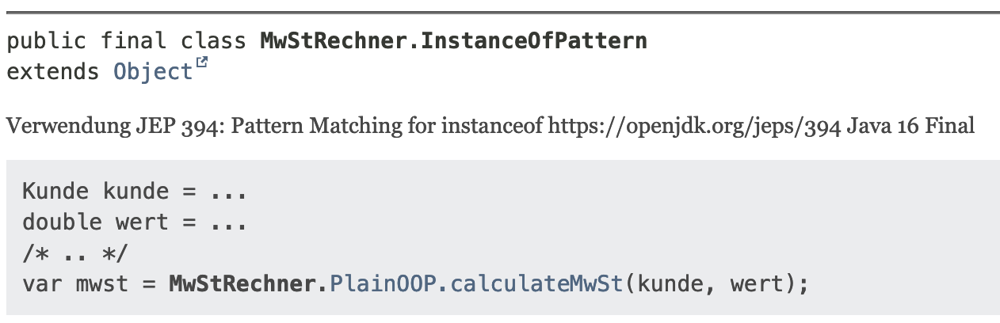

Die Sprache Java und das JDK Ökosystem sind voller versteckter Schätze.
Diese zu entdecken erfordert eine kleine Expedition durch einige JDK Enhancement Proposals, sogenannte JEPs.
Während der Expedition in diesem Beitrag werden wir private Methoden in Interfaces und Java Code in Kommentaren sehen.
Doch auch für den Betrieb von Anwendungen auf der JDK gibt es interessantes wie die Zurückgabe von Speicher, vorkonfigurierte Classloader Informationen und Paketierung von Anwendungen.

## Für die Entwicklung
Die Expedition zu den eher unbekannten Features des JDK Ökosystems beginnend bei der Entwicklung von Programmen, genauer gesagt bei Interfaces.

### Private Interface Methods
Seit Java 8 können Interfaces in Java neben den Definitionen von Methoden auch Logic beinhalten.
Dies war notwendig geworden, um Lambdas und die Stream-API elegant umsetzen zu können.
Zu diesem Zweck wurden statische Methoden und Default-Methoden in Interfaces erlaubt.
Mit diesen ist es unter anderem möglich, ein Factory Pattern direkt in einem Interface zu implementieren, wie im Beispiel der Reference.
```java
interface Reference {
  class StringReference implements Reference {
    private StringReference(String s) {/* ... */}
  }
  class IntegerReference implements Reference {
    private IntegerReference(int s) {/* ... */}
  }
  String asString();
  
  static Reference of(Object ref) {
    if (ref instanceof String) return new StringReference((String) ref);
    if (ref instanceof Integer) return new IntegerReference((Integer) ref);
    // ...
  }
}
```
Mit der Factory Methode `Reference.of(/**/)` wird abhängig vom Übergabe Typ eine andere Implementierung erzeugt und die Logic gegenüber dem aufrufenden Code verborgen.
Sollen Standardimplementierungen für bestimmte Aspekte einer Reference geteilt werden, können Default Methoden verwendet werden.
Im unteren Beispiel wird für jede Implementierung von Reference eine Default Implementierung für `asString` bereitgestellt.
Diese wird durch den Qualifier `default` markiert und kann in jeder Implementierung überschrieben werden.
```java
import java.net.URI;
import java.net.URL;

interface Reference {
  default String asString()  {
    return URI.create("https://example.de/ref/" + this).toString();
  }
  
  static void print(Reference ref) {
    System.out.println(ref.asString());
  }
}
```
In diesem Beispiel kann über `Reference.print(r)` eine Reference auf Standard-Out geschrieben werden.
Intern wird die `asString` Method verwendet, die in jeder Instanz überschrieben werden kann.
Das führt zu eventuell ungewollt ungleichmäßigen Ausgaben von `print`.
Hier können die privaten Interface-Methoden weiter helfen, dieses Detail zu verstecken.
In dem unteren Beispiel wird die Methode `asUri` verwendet, um aus einer Reference eine Instanz von URI zu machen.
Diese Methode wird in `print` verwendet, um eine einheitliche Ausgabe zu gewährleisten.
```java
import java.net.URI;
import java.net.URL;

interface Reference {
  default String asString()  {
    return asUri().toString();
  }
  
  private URI asUri() {
    return URI.create("https://example.de/ref/" + this);
  }
  
  static void print(Reference ref) {
    System.out.println(ref.asUri());
  }
}
```

Zugegeben ist das Beispiel etwas sehr einfach gewählt, aber es reicht aus, um die Syntax kennenzulernen und die Möglichkeiten zu verstehen.
Die Methoden `asUri` und `print` können in realen Anwendungen deutlich komplexer sein, dann entfalten private Methoden in Interfaces ihre Kraft und reduzieren stark die Anzahl an Duplikaten.

### Java Snippets in JavaDoc
Meist werden Programme entwickelt, die über Jahre gepflegt und gewartet werden müssen.
Solche Programme benötigen eine solide Dokumentation, besonders, wenn die in anderen Kontexten wiederverwendet werden sollen.
Aus diesem Grund wurde schon in der ersten Version der JDK das Tool javadoc eingeführt.
Mit ihm lassen sich Dokumentationen, die im Source Code gemacht wurden, zu einer durchsuchbaren HTML-Schnittstellen-Dokumentation transformieren.
In solchen technischen Dokumenten ist es sinnvoll, die beabsichtigte Verwendung der Schnittstelle zu skizzieren.
Hierzu wurde oft der `{@code }` Tag verwendet, mit dem der Source Code schonmal hervorgehoben wird, ist aber nicht gut anwendbar bei mehrzeiligen Passagen.
Dies ist seit Java 18 mit dem neuen Tag `{@snippet : }` Geschichte.
In dem Listing unten wird mit dem Snippet Tag eine Passage der Verwendung einer Klasse MwStRechner demonstriert.
In der final genierten Dokumentation bleibt die Formatierung erhalten, einzig mehrzeilige Kommentare sind hier nicht erlaubt.
```java
/**
 * Berechnung der MwSt für einen Privatkunden beim Einkauf in Höhe von 1055
 * {@snippet :
 *   var kunde = new Privatkunde("Merlin", "");
 *   var wert = 1055d;
 *   // ...
 *   var mwst = MwStRechner.PlainOOP.calculateMwSt(kunde, wert);
 * }
 */
```
Ein Problem ist im obigen Listing weiterhin ungelöst, der Code kann nicht getestet werden und kann Syntaxfehler enthalten.
Um dieses Problem zu lösen, können mit dem Snippet Tag auch Bereiche aus Java Dateien geladen werden.
Innerhalb der zugrundeliegenden Dateien werden Transformationen vorgenommen, um die Lesbarkeit und Aussagekraft zu verbessern.
Hierzu gehören unter anderem
* Ersetzungen von Passagen durch einen anderen Text
* Highlighting von anhand von Regex Ausdrücken
* Definitionen von Bereichen

Eine komplette Liste ist in der JEP 412 gegeben.
In dem unteren Listing ist ein komplettes Beispiel gegeben wie ein Bereich aus der Datei snippet-files/SwitchExpressionsSnippets.java, unten, im JavaDoc einer anderen Datei eingebunden werden kann.
```java
// Datei: MwStRechner.java
/**
 * Berechnung der MwSt für einen Privatkunden beim Einkauf in Höhe von 1055
 * {@snippet file="SwitchExpressionsSnippets.java" region="example"}
 */

// Datei: snippet-files/SwitchExpressionsSnippets.java
class Snippets {
  void snippet01() {
    // @start region="example"
    // @replace region="replace" regex='(= new.*;)|(= [0-9]*d;)' replacement="= ..."
    // @highlight region="highlight" regex="\bMwStRechner\b"
    var kunde = new Privatkunde("Merlin", "test@other.de"); // @replace regex="var" replacement="Kunde"
    var wert = 1055d; // @replace regex="var" replacement="double"
    /* .. */
    var mwst = MwStRechner.PlainOOP.calculateMwSt(kunde, wert); // @link substring="PlainOOP.calculateMwSt" target="MwStRechner.PlainOOP#calculateMwSt"
    // @end @end @end
  }
}
```
Hierbei werden einige Bereiche ersetzt und markiert, das finale Ergebnis gibt eine gute Übersicht über die Verwendung und kann regelmäßigen Tests unterzogen werden.


## Für den Betrieb in der ☁️
In Java geschriebene Anwendungen werden in vielfältigen Umgebungen zur Ausführung gebracht und jede hat ihre eigenen Anforderungen.
Um diesen gerecht zu werden wurden in den letzten Versionen von Java unter anderem der Umgang mit Resourcen, das Verhalten beim Laden von Classfiles sowie das Kombinieren zu Bundles überarbeitet.

### Resourcenverbrauch
In Java geschriebene Anwendungen werden in vielfältigen Umgebungen zur Ausführung gebracht und jede hat ihre eigenen Anforderungen.
Um diesen gerecht zu werden, wurden in den letzten Versionen von Java unter anderem der Umgang mit Resourcen, das Verhalten beim Laden von Classfiles sowie das Kombinieren zu Bundles überarbeitet.

Wird eine Anwendung in einem Container betrieben, wird der umsichtige Umgang mit Resourcen sehr relevant und kann viel Geld sparen.
Eine Anwendung sollte nicht mehr benötigten Speicher wieder freigeben, damit die Auslastung korrekt bestimmt werden kann und ein Resizing vorgenommen werden kann.
Leider hat die Java Virtual Machine (JVM) in der Vergangenheit keinen Speicher wieder freigegeben, sondern jeden verfügbaren Speicher reserviert.
Dieses Verhalten ist eine natürliche Heuristik in einem System, das für eine einzelne Anwendung betrieben wird.
Denn das Reservieren (allokieren) von Arbeitsspeicher ist aufwendiger als die JVM-eigene Verwaltung.

In dem Zeitalter der Cloud ist die Annahme hinter dieser Heuristik nicht mehr aktuell.
Seit [JEP 346](https://openjdk.org/jeps/346) gehört das Speicher fressende Verhalten der JVM endgültig der Vergangenheit an.
Mit dieser JEP wurde der G1 Garbage Collector befähigt, dem Betriebssystem freien Speicher zu melden.
Durch diese Meldung kann der Speicherverbrauch um bis zu 85% gesenkt werden.
Diese Anpassung ist seit Java 12 im G1 GC und Serial GC enthalten.
Neben diesen beiden unterstützen auch Shenandoag GC und der seit Java 11 neue ZGC die Rückgabe von allokiertem Speicher an das Betriebssystem.

Das genaue Verhalten der GCs kann durch einige wenige Kommandozeilen Parameter konfiguriert werden.
Wie die Werte in einem konkreten Fall auszuwählen sind, muss experimentell ermittelt werden.
* `-XX:GCTimeRation` konfiguriert die das Verhältnis von der Application und GC Laufzeit
* `-XX:MinHeapFreeRatio` gibt an, wie viel Memory nach einem GC-Lauf mindestens frei sein soll. Ist der reale Wert kleiner, wird der Heap vergrößert.
* `-XX:MaxHeapFreeRatio` gibt an, wie viel Memory nach einem GC-Lauf maximal frei sein soll. Ist der reale Wert größer, dann wird der Heap verkleinert.

Mit diesen Einstellungen kann die JVM auf Sparsamkeit konfiguriert werden.
Zu große Sparsamkeit geht aber in der Regel negativ auf die Performance ein.

### Dynamic App CDS
Die JVM ist zu einer Zeit initial entwickelt worden, zu der die Peak Performance von lang läufigen Anwendungen sehr viel relevanter war als in den heutigen Microservice getriebenen Zeiten.
Einige der damals besten Heuristiken zahlen sich heute in einigen Bereichen nicht mehr aus.
Durch sie kommt es zu der vergleichsweise schlechten Start-up-Performance der JVM.
Doch wie auch der Speicherverbrauch wurde dies in den letzten Versionen von Java angegangen.

Um die Startperformance einer JVM-Applikation zu verbessern, hilft es, den initialen Classloading-Prozess zu beschleunigen.
Zu diesem Zweck wurde das Class-Data-Sharing, kurz CDS, in die JVM eingeführt.
Kern dieser Technik ist ein Abbild der JVM-Metadaten.
Dieses Abbild wird von einer erfolgreich gestarteten JVM genommen und bei jedem Start der JVM verwendet, um die Standardbibliotheken nicht erneut laden zu müssen.
Das Abbild ist als `classes.jsa` Datei im Teil der ausgelieferten JVM und wurde mit einer für G1 konfigurierten JVM mit 128MB Heapspace erstellt.

Damit auch die Klassen einer Anwendung korrekt von Beginn an im CDS-Archive enthalten sind, wurde das Konzept CDS erweitert.
Mit Application Class-Data Sharing, auch AppCDS genannt, wird auch der Classpath einer Anwendung mit in das erzeugte CDS-Archive übernommen.
Dadruch kann die Startzeit einer JVM deutlich verkürzt werden und die Einsparungen wachsen weiter, wenn dieselbe Anwendung auf mehreren JVMs betrieben oder häufig neu gestartet wird.

Die Erzeugung eins CDS Archivs benötigt Informationen über die zur Laufzeit verwendeten Klassen in einer Anwendung.
* Diese können in einem Trainingslauf bestimmt werden:
  1. `java -Xshare:off -XX:DumpLoadedClassList=clazzes.cls -cp app.jar MyApp` startet die Anwendung und erzeugt eine Liste der geladenen Klassen als _clazzes.cls_ Datei
  2.  `java -Xshare:dump -XX:SharedArchiveFile=MyApp.jsa -XX:SharedClassListFile=clazzes.cls -cp app.jar` erzeugt ein Applikation-CDS-Archiv in der Datei _MyApp.jsa_
* Per JCMD aus der Produktion bestimmt werden
  1. Die Anwendung in Produktion muss mit dem Parameter `-XX:+RecordDynamicDumpInfo` gestartet werden.
  2. `jcmd <pid> VM.cds dynamic_dump my_dynamic_archive.jsa` das Kommando VM.cds erzeugt ein CDS Archive aus der aktuell unter der angegeben PID laufenden JVM
* Nach jeder Terminierung der JVM kann ein CDS Archive geschrieben werden. Hierzu muss die Anwendung lediglich mit dem Parameter `-XX:ArchiveClassesAtExit=MyApp.jsa` gestartet werden. Die Erzeugte JSA kann dann verteilt werden.

Um eine Anwendung mit dem erzeugten CDS Archive zu starten und von den gesammelten Informationen zu profitieren, muss die JVM lediglich mit dem Parameter `-XX:SharedArchiveFile=MyApp.jsa` gestartet werden.
Mit diesen wenigen zusätzlichen Schritten kann die Startperformance einer JVM Anwendung deutlich verbessert werden und gleichzeitig von der hohen Peakperformance bei langen Laufzeiten profitiert werden.
Mit diesen Anpassungen ist die JVM gewappnet für Umgebungen, in denen die JVM erneut gestartet werden muss.

## JPackage für Installationen
Endbenutzer von Software sind häufig nicht aus der IT und finden noch viel seltener Freude daran, eine Anwendung aus der Kommandozeile zu starten.
Die Verteilung von Java-Anwendungen ist besonders komplex, da neben der eigentlichen Anwendung auch eine passende Java-Umgebung zur Verfügung stehen muss.
Die Lösung sind installierbare Anwendungen, die ihre Laufzeitumgebung direkt bereitstellen, doch die Erstellung von solchen Paketen ist in der Regel keine leichte Aufgabe.

Diese Lücke füllt das Kommandozeilenwerkzeuk [JPackage](https://docs.oracle.com/en/java/javase/21/docs/specs/man/jpackage.html) welches seit Java 14 fester Bestandteil des Java Development Kits ist.
JPackage übernimmt die Paketierung eines Softwareartefakts in ein natives Installationspaket.

Die Paketierung muss auf derselben Art von Betriebssystem durchgeführt wie das Zielsystem, denn leider gibt es eine Cross-Plattform-Option.
Für die verschiedenen, gängigen Betriebssysteme stehen unterschiedliche Möglichkeiten bereit:
* _exe_ und _msi_ für Windows
* _rpm_ und _deb_ für Linux
* _dmg_ und _pkg_ für MacOS

Als Eingabe für den Prozess wird eine übersetzte Applikation mit den notwendigen Ressourcen in einem Ordner erwartet.
Unter der Angabe eines Hauptarchivs, einer Startklasse und eines Namens wird ein entsprechendes Installationspaket erstellt.
In dem unten stehenden Beispiel wird ein Installationspaket für Windows mit dem Namen _MySimpleApp_ aus den Ressourcen im Ordner _dist_ erstellt.
Als Startpunkt wird die Klasse _MyMainClass_ in der JAR _myJar.jar_ angegeben.
```bash
jpackage --type exe \ 
        -n MySimpleApp \
        -i dist \
        --main-class MyMainClass \ 
        --main-jar myJar.jar
```
Es gibt noch viele weitere Konfigurationsmöglichkeiten, Plattform und Zielformat abhängige Konfigurationen.
Eine vollständige Liste findet sich unter der JDK Spezifikation unter [JPackage](https://docs.oracle.com/en/java/javase/21/docs/specs/man/jpackage.html#options-for-creating-the-application-image).
Hier sind einige interessante Themenbereiche:
* Informationen über Lizenzen und Kontaktadressen
* Konfigurationsparameter für die JVM und das Umfeld
* Zertifizierung, Updateinformationen und Installationsdetails

Durch die Paketierung als natives Installationspaket können in Java geschriebene Anwendungen bequem in Installationspakete verpackt werden.
Diese Pakete sind jedem Endnutzer zumutbar und ermöglichen auch eine automatisierte Installation durch Administratoren.

In diesem Beitrag habe ich einige weniger bekannte Werkzeuge aus der Java-Welt vorgestellt.
Unter der Zuhilfenahme dieser Werkzeuge können schnell startende und ressourcenschonende Anwendungen mit eleganten und gut dokumentierten Java geschrieben und einfach installiert werden.
